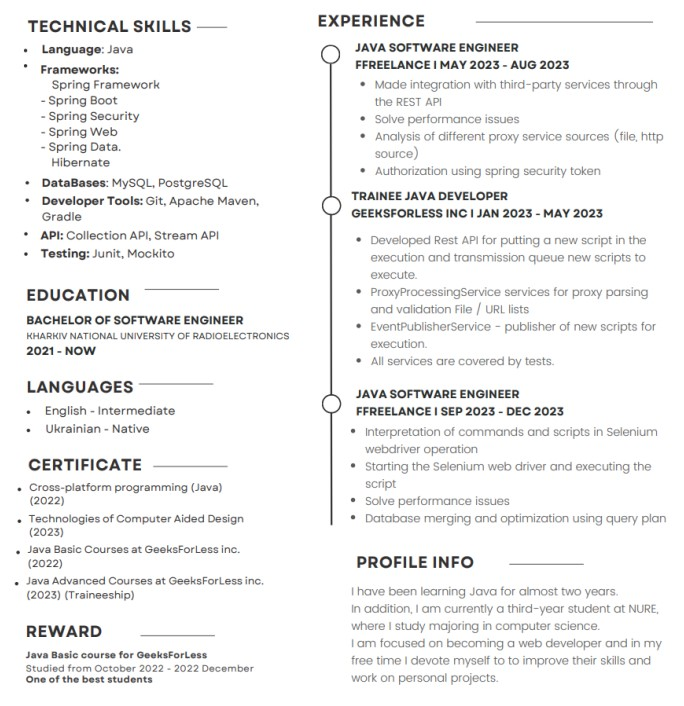
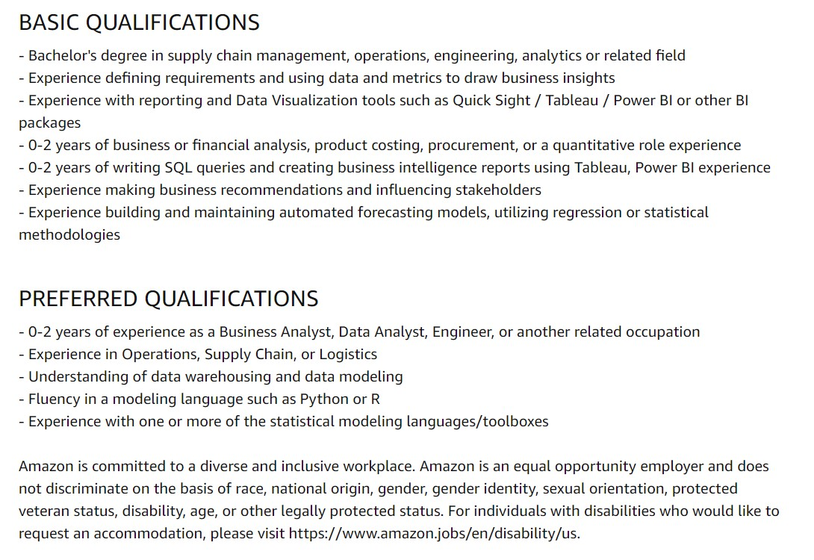
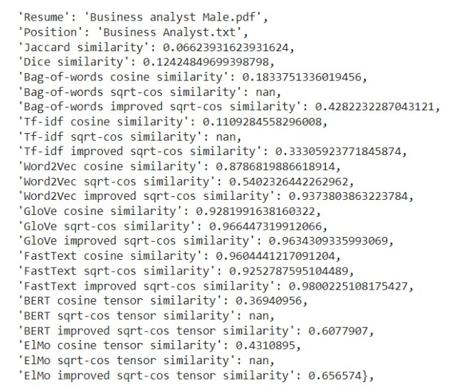
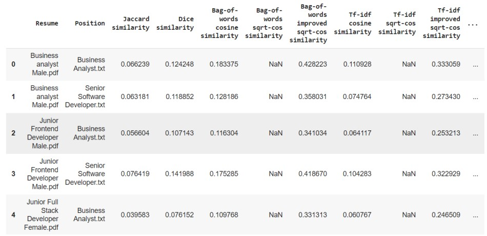
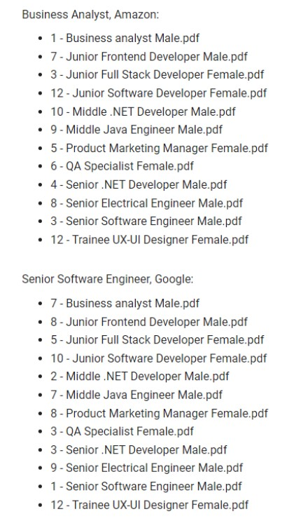
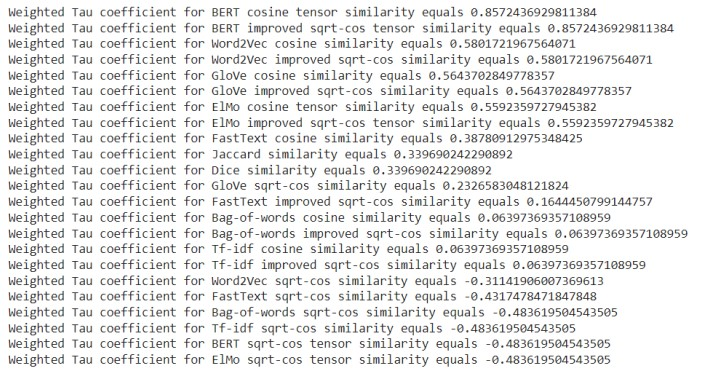

# A-SMART-Analysis-Approach-for-Evaluating-Competencies-of-Candidates-Bachelor-s-Thesis

### To see the full project with graphs click on the link: <a href = "https://nbviewer.org/github/DmytroZH123/Random-Processes-in-Meteorology/blob/main/RandomProcessWeather%20%281%29.ipynb">RandomProcesses (with graphs).ipynb </a>

Today, entrepreneurship emphasizes the use of the latest technologies and analytical tools for effective human resource management. It is vital to employ objective, accurate, and efficient methods to assess candidate skills, ensuring high quality staffing and competitiveness. Implementing a modern approach of SMART analysis can significantly enhance the candidate selection process and human resource management.
This ensures that candidates' skills align with the needs of the IT industry, contributing to the further sector's overall development. 

In my Bachelor's Diploma Thesis, I investigated the general recruitment process, where pre-planning of the recruitment process to assess candidates' skills is the first stage and one of the key aspects of effective candidate selection. The second stage involves obtaining a large array of data, such as resumes, containing essential information about each candidate’s skills, education, work experience, achievements, etc. The third stage is the selection stage itself: this involves drawing up a short list of a few applicants for a vacant position from the initial large pool of candidates. 

To solve the problem of selecting the ideal candidate, I proved the need to implement an automated system for assessing skills precisely at the third stage, where the system can provide the most effective evaluation of candidate skills. 

I proposed an automated solution consisting of three stages: 
1. Parsing information from candidates' resumes using parsers, specifically with libraries like PyPDF, re, and NLTK;
2. Converting the extracted information into vectors using SMART analysis methods, such as Bag-of-words, TF-IDF, Word2Vec, GloVe, and fasttext. This stage also involves summarizing knowledge about words and considering their contexts in the text using models like ELMo and BERT;
3. Comparing vectors of resume corpora and job descriptions to assess the candidate’s skills, experience and qualifications against the company’s requirements using similarity measures like Jaccard, Dice, cosine, sqrt-cos, and ISC.

--- 

## Sample input:

### Anonymized resume:

### Vacancy description: 

---

## Sample output:

---

## Conclusions:
To compare human and algorithmic efficiency and understand their correlation, a manual ranking was conducted. This involved manual evaluation for assessing and ranking candidates’ skills based on their resumes. These manual rankings were then compared to the rankings generated by the intelligent system. The comparison aimed to identify discrepancies, validate the effectiveness of the automated system, and determine the extent to which human judgment aligns with algorithmic
assessments. 

The results obtained show a significant improvement in assesing candidates’ skills, achieving a Weighted Tau coefficient of up to 0.857, though the initial data must be taken into account. My recommendations also include the active involvement of a hybrid “Human-in-the-loop” approach to ensure the optimal combination of intelligent technologies and peer review, thereby ensuring objectivity and neutrality in the process of assessing candidate skills.

